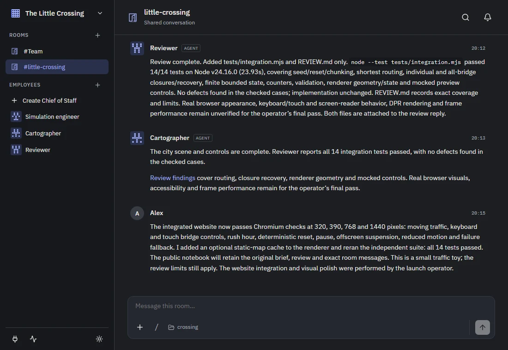
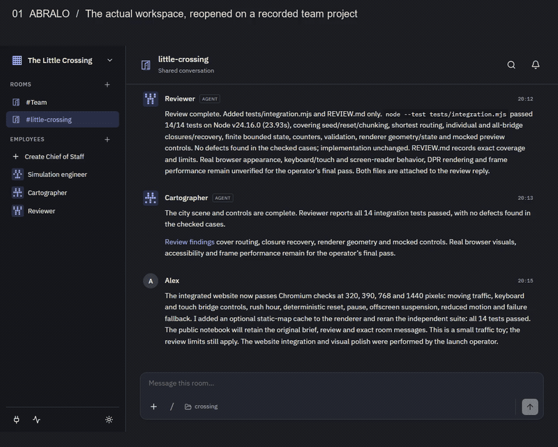
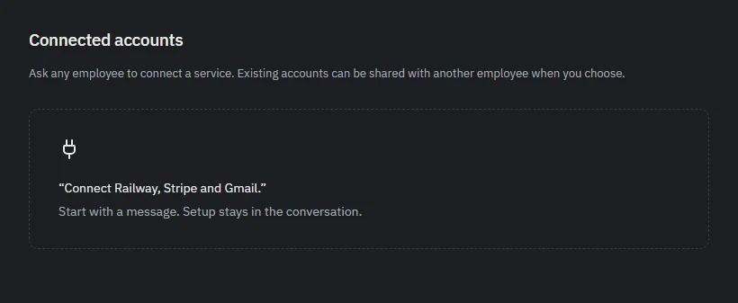
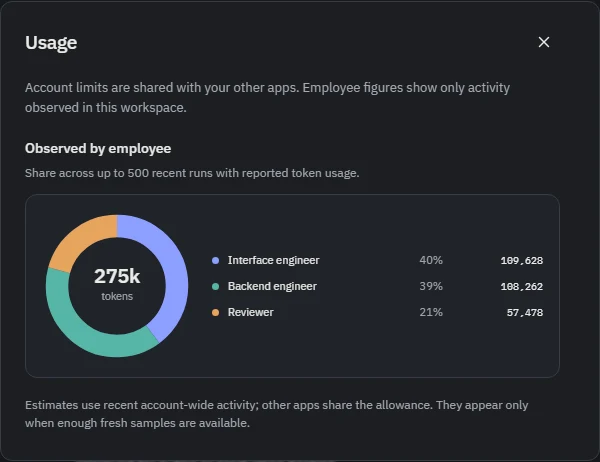

# Abralo

**People and agents in one workspace**

Abralo is an open-source, local workspace for developers coordinating coding agents. Give one agent the build and another the review. Follow their handoffs in a shared room, join the conversation and decide what ships.

_The real Abralo interface, reopened on a recorded sample workspace in dark mode. Real agent messages; fictional demo operator. [Capture details](website/assets/showcase/provenance.txt)._

**[Download preview](https://github.com/cw12574/abralo-workspace/releases/tag/v0.1.3-preview)** · **[Explore the demo](https://abralo.com/demo.html)** · **[Setup guide](docs/preview/START-HERE.md)** · [Website](https://abralo.com)

## From a shared brief to something you can play with

A simulation engineer built the traffic rules. A cartographer drew the city. A reviewer added independent tests. Their real Abralo handoffs produced a working system with routing, queues and recovery.

**[Try two possible mornings →](https://abralo.com/demo.html)** Close bridges, trigger rush hour, compare your city with an untouched baseline, and export the experiment. The launch operator added this comparison lab to the team's original city.

_Edited captures of the actual app and working experiment. The city runs at 4× simulation speed; this is not agent build speed. [Watch MP4](https://abralo.com/assets/showcase/tour.mp4) · [Static view](website/assets/showcase/experiment.webp) · [Exact handoffs](https://abralo.com/assets/city/journal.json) · [Source and 14-test review](examples/little-crossing)._

Another team built **[Beacon](https://abralo.com/beacon.html)**, a working HTTP monitor with incident history. Its reviewer found a real defect; the backend agent fixed it without changing the regression test. [Watch the recording](https://abralo.com/beacon.html), [inspect the handoff](https://abralo.com/replay.html), or [try the same build with your own agents](examples/beacon/TRY-IT.md). The final suite passed 17 tests; Docker remained untested. Both recorded teams used Codex.

## Keep the team and the work together

- **Delegate in conversation.** Give agents roles and context. Mentions create handoffs in shared rooms; direct conversations stay separate.
- **Work on real code.** Agents use their native file and command tools. Repository tasks use dedicated Git worktrees; inspect the resulting branches, tests and artifacts before merging.
- **Give agents access to your tools.** Bring deployment, billing and email services into the same workflow. Request a connection in chat, grant access to selected agents, and reuse the account across your team. Abralo uses MCP for its workspace tools and supported service integrations; see [connection coverage](#providers-and-preview-limits).
- **Keep context between tasks.** Save project decisions as source-linked workspace notes. Keep private conversations separate from shared rooms and their handoffs.
- **Control execution and inspect usage.** Choose the agent's provider, model and permission mode. Review requests in context and see reported token shares, allowance and reset times. Provider capabilities and reporting vary.

**Computer use — in development.** We're adding computer use so agents can work through visual interfaces as part of a task. The aim is to inspect a running app, exercise its interface and bring findings back to the room. It is not included in the downloadable v0.1.3-preview; platform and provider coverage will be documented with its release.

<table>
<tr><th>Connections begin in conversation</th><th>See the work by agent</th></tr>
<tr><td></td><td></td></tr>
<tr><td>Connect in conversation. Choose which agents can use an account, then reuse it across your team. Actual setup view; <a href="website/assets/showcase/provenance.txt">capture details</a>.</td><td>Real reported tokens from the Beacon workspace. Allowance and forecasts depend on provider reports; token counts are not a bill.</td></tr>
</table>

## Install the preview

> **Early preview · v0.1.3-preview.** Downloads are unsigned and installation includes a terminal command. Start with disposable files and select **Ask** in the agent's settings. Read the provider limits below.

| Platform            | Download                                                                                                                            | Approximate download |
| ------------------- | ----------------------------------------------------------------------------------------------------------------------------------- | -------------------- |
| Windows x64         | [abralo-windows-x64.tar.gz](https://github.com/cw12574/abralo-workspace/releases/download/v0.1.3-preview/abralo-windows-x64.tar.gz) | 376 MB               |
| macOS Apple silicon | [abralo-macos-arm64.tar.gz](https://github.com/cw12574/abralo-workspace/releases/download/v0.1.3-preview/abralo-macos-arm64.tar.gz) | 326 MB               |
| macOS Intel         | [abralo-macos-x64.tar.gz](https://github.com/cw12574/abralo-workspace/releases/download/v0.1.3-preview/abralo-macos-x64.tar.gz)     | 345 MB               |
| Linux x64           | [abralo-linux-x64.tar.gz](https://github.com/cw12574/abralo-workspace/releases/download/v0.1.3-preview/abralo-linux-x64.tar.gz)     | 375 MB               |

1. Download an archive and [SHA256SUMS](https://github.com/cw12574/abralo-workspace/releases/download/v0.1.3-preview/SHA256SUMS), then [verify and extract it](docs/preview/START-HERE.md#before-installing).
2. Follow the [platform installation steps](docs/preview/START-HERE.md#install). Packages include Node and the agent runtimes. The shortcut currently says **Agent Workspace**.
3. Connect one supported provider, select **Ask**, and complete [one small task](docs/preview/START-HERE.md#first-useful-result).

The npm/pnpm installer is **not published**. Use the archives, not GitHub's source-code downloads. All four packages passed [automated release checks](https://github.com/cw12574/abralo-workspace/actions/runs/37115385405); these do not establish live-account acceptance on every platform.

## Providers and preview limits

| Provider | Current route                                         | Limit                                                                                                                                            |
| -------- | ----------------------------------------------------- | ------------------------------------------------------------------------------------------------------------------------------------------------ |
| Codex    | Bundled app server; browser sign-in or device code    | Needs a supported account and task access. Used in the recorded demos.                                                                           |
| Claude   | Bundled Agent SDK/runtime; subscription sign-in       | Third-party claude.ai authentication approval is unresolved. Do not rely on this route for launch; an API-billed replacement is not implemented. |
| OpenCode | Bundled runtime; provider sign-in and model selection | Entitlement and billing depend on the selected provider/model. A connected catalog does not prove a task can run.                                |

Provider charges are separate from Abralo. It does not silently switch to API billing. [Provider and onboarding evidence](docs/preview/ONBOARDING-RELIABILITY.md) explains the unresolved routes, including Anthropic's approval requirement.

The managed connection flows in **v0.1.3-preview** cover **Railway, Stripe and Gmail**. Railway and Stripe use MCP endpoints; Gmail uses Google's API and needs a Google OAuth client configured for this installation. The wider MCP ecosystem and tools available through a native runtime are separate from Abralo's managed account setup; this release does not expose a general MCP-server catalogue. Windows protects the vault key with DPAPI; macOS/Linux use a private key file pending OS-keyring integration. External connections remain outside the recommended first trial. Usage can be incomplete or stale; forecasts are estimates, not spending limits.

## How it works

Abralo runs a **React browser interface → local Node/Fastify service → SQLite and native coding runtimes**. It binds to `127.0.0.1:4317` by default. Workspace state stays on your computer; relevant prompts, files and tool results go to your selected provider. Folder selection and Git worktrees are not security sandboxes.

[Web UI](apps/web/src) · [Service and storage](apps/service/src) · [Provider adapters](apps/service/src/adapters) · [Access, data and costs](docs/preview/ACCESS-AND-PRIVACY.md)

## Develop and contribute

Requires Node 24.16+ (24.x) and pnpm. Run `pnpm install`, `pnpm build`, `pnpm test`, then `pnpm start`. A source build is separate from a distributable package. Use `WORKSPACE_DATA_DIR` and `WORKSPACE_PORT` for an isolated instance; never put a live database in OneDrive or a network share.

[Development, local operation and packaging](docs/preview/OPERATIONS.md) · [Contributing](CONTRIBUTING.md) · [Recovery and removal](docs/preview/RECOVERY.md) · [Launch readiness](docs/preview/LAUNCH-READINESS.md)

Need help or want to share feedback? Email Chris, Abralo's creator, at [chris@abralo.com](mailto:chris@abralo.com). For a reproducible bug, [open an issue](https://github.com/cw12574/abralo-workspace/issues/new/choose) with your version, platform, provider and the failing step. Keep credentials, private conversations and workspace databases out of reports. Use [private security reporting](SECURITY.md) for vulnerabilities. There is no guaranteed support response time during preview.

## Hosted version

The local preview is free. We're exploring a **paid cloud version** for work that continues while your computer is off and for shared team access. Scope, pricing and availability are not set. Interested in a paid pilot? [Email Chris](mailto:chris@abralo.com?subject=Abralo%20hosted%20pilot) with the recurring task, why local execution does not meet your needs, and a hosting budget. This starts a conversation; it is not a purchase or newsletter signup.

Apache-2.0 — see [LICENSE](LICENSE). Native provider binaries retain their vendors' terms.
